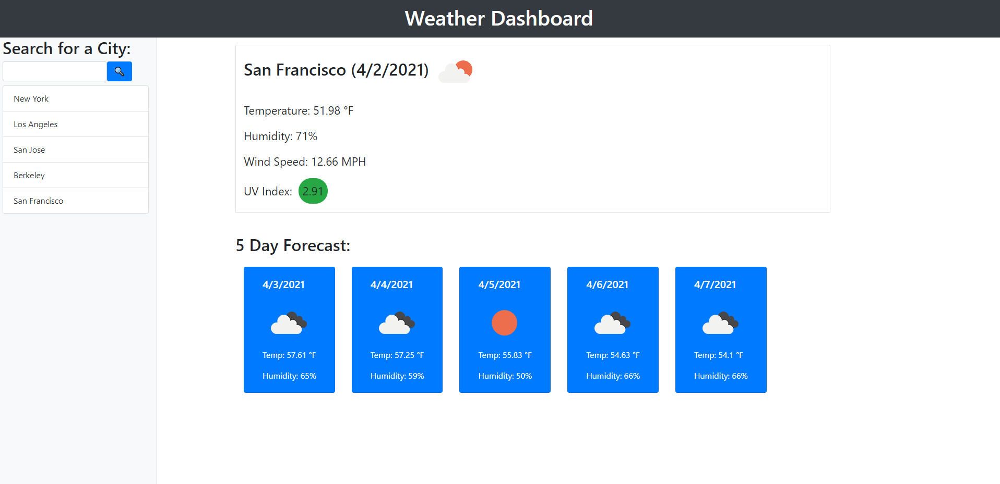

# 6-weather-dashboard
In this project I created a weather dashboard viewing application. The application consists of creating a navigatable dashboard that allows the user to view the weather data. The app runs in the browser and features dynamically updated HTML and CSS powered by JavaScript code. It has a clean, polished, and responsive user interface. It uses the [OpenWeather API](https://openweathermap.org/api) to retrieve weather data for cities.

It contains notable features such as:
- a searchbar connected to the OpenWeather API to search for cities.
- a display of the weather for the current day. It will contain notable features such as:
  - city's name
  - current Date
  - an icon representing the weather conditions (cloudy, sunny, etc.)
  - tempurature
  - humidity
  - wind speed
  - UV index
    - the UV index's value will be inside a container color coded based on the UV index's severity. Green, yellow, and red corresponds to favorable, moderate, or severe.
- a 5-day forecast under the current day's weather. It will contain notable feature such as:
  - date
  - an icon representing the weather conditions (cloudy, sunny, etc.)
  - temperature
  - humidity
- a city viewing history bar that updates as you look through cities
  - clicking a city in the history bar will display the city's weather data
  - city viewing history will save in the browser's local storage

Due: Monday, April 5, 2021 11:59 PM

## Built With

* [HTML](https://developer.mozilla.org/en-US/docs/Web/HTML)
* [CSS](https://developer.mozilla.org/en-US/docs/Web/CSS)
* [Javascript](https://developer.mozilla.org/en-US/docs/Web/JavaScript)
* [Bootstrap](https://getbootstrap.com/)
* [jQuery](https://api.jquery.com/)
* [OpenWeather API](https://openweathermap.org/api)
* [moment.js](https://momentjs.com/)

## Deployed Link

* [See Live Site](https://acedyu.github.io/6-weather-dashboard/)

## Authors
AcedYu
- [Link to Github](https://github.com/AcedYu)
- [Link to LinkedIn](https://www.linkedin.com/in/alex-yu-3712811b9/)
